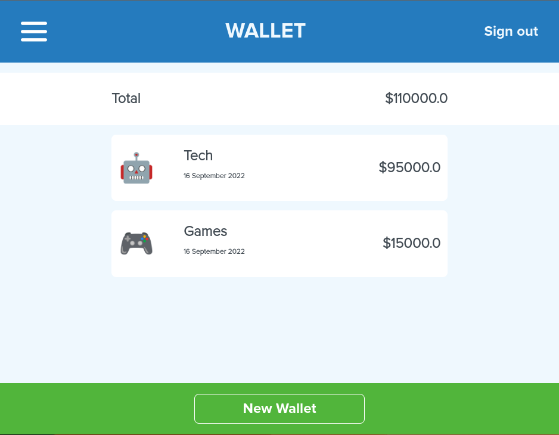

# My Wallet

My Wallet is meant to help you organize your investments across different categories. This fully functional website shows you a list of all your wallets and the total value on them, it also displays the total amount of investments separated by wallet. It can be used by different users within the local database that was design for this application.


Here it is the main screen of the application:

</br>
 <div align="center">
    
    <p>My Wallet</p>
</div>

## Getting Started
To run the project locally, copy up and running follow these simple example steps :

 - First of all make sure you have both `Ruby` & `Rails` installed in your machine
 (else You can install `Rails` just with this simple command  ```gem install rails```)
 - clone the project with the following command line : 
```
$ git clone git@github.com:fabianofrank/rails-wallet.git
```
 - Then go to the right folder 
```
$ cd rails-wallet
```
```
$ bundle-install
```
and run to install npm package
```
$ npm install
```

make sure the database is up and running.
```
$ rails db:create
```
When you will add migration file then, you can add command like
```
$ rails db:migrate
```
Run this command line to add some dummy data
```
$ rails db:seed
```

 - Finaly run `rails s` and visit http://localhost:3000/  in your browser!

 ## Run tests :

 To run Request specs locally you need just to run this following command in your terminal :

 ```
 $ bundle exec rspec
 ```
 <!-- </br>
 <div align="center">
    <kbd>
    
    <p>16 Request Specs passed</p>
       </kbd>
</div> -->

## Built With

 - Ruby on RAils  
 - PostgreSQL 
</br>

## Author

👤 **Fabiano Frank**

- GitHub: [@fabianofrank](https://github.com/fabianofrank)
- Twitter: [@fabianofrankk](https://twitter.com/fabianofrankk)
- LinkedIn: [LinkedIn](https://www.linkedin.com/in/fabianofrank/)

## 🤝 Contributing

Contributions, issues, and feature requests are welcome!

Feel free to check the [issues page](https://github.com/fabianofrank/rails-blog-app/issues).

## Show your support

Give a ⭐️ if you like this project!

## Acknowledgments

- Inspiration 💘
- Microverse program ⚡
- My standup team 😍
- My family's support 🙌
- MicroBros 😜

## 📝 License

This project is [MIT](https://github.com/fabianofrank/rails-blog-app/blob/develop/LICENSE.md) licensed.